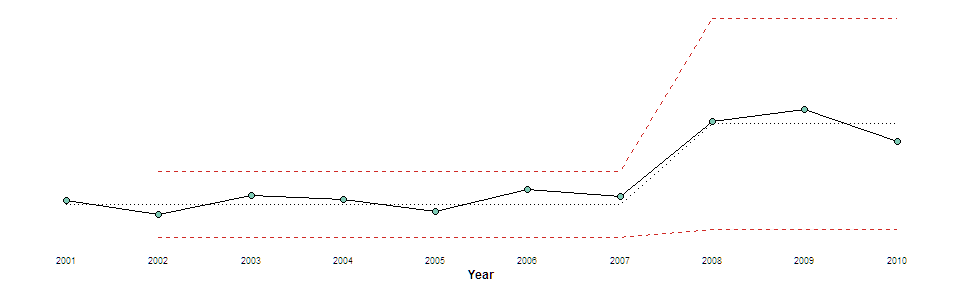

# Automatic Reporting with RMarkdown

This is an example of the automatic reporting workflow that I use in R.

## Pre-Requisites

You need R and RStudio, if neither are installed on your machine and you
just want to stand something up to play around -
[rstudio.cloud](https://rstudio.cloud/) has you covered.

But, you will need to install some packages:

    install.packages("tidyverse") # generic R utilities
    install.packages("rmarkdown") # reporting package
    install.packages("glue")      # strings + data
    install.packages("xmrr")      # creates xmr data and charts

## Procedure

### Step 1 - Data

In this tutorial you are provided a script to generate data in the
`code/Make_Data.R` file. In the real world, you’ll want to use real
data.

Data in this tutorial is in a long format. This means measures are kept
in a column called `Measure` and their values are kept in a column
called `Value`.

``` r
library(tidyverse)
library(xmrr)

my_data = read_csv("data/all_data.csv")

my_data
```

    ## # A tibble: 60 x 4
    ##    Program                 Measure         Year Value
    ##    <chr>                   <chr>          <dbl> <dbl>
    ##  1 Basket Weaving          Retention Rate  2001 0.301
    ##  2 Printing Press Operator Retention Rate  2001 0.265
    ##  3 Woodcutter              Retention Rate  2001 0.375
    ##  4 Basket Weaving          Retention Rate  2002 0.387
    ##  5 Printing Press Operator Retention Rate  2002 0.278
    ##  6 Woodcutter              Retention Rate  2002 0.210
    ##  7 Basket Weaving          Retention Rate  2003 0.281
    ##  8 Printing Press Operator Retention Rate  2003 0.296
    ##  9 Woodcutter              Retention Rate  2003 0.216
    ## 10 Basket Weaving          Retention Rate  2004 0.369
    ## # ... with 50 more rows

This long format is used to make efficient use of the `xmrr` package.

``` r
xmr_data = my_data %>% 
  group_by(Program, Measure) %>% 
  xmr2(Value)

xmr_data
```

    ## # A tibble: 60 x 10
    ##    Program Measure  Year Value Order `Central Line` `Moving Range`
    ##    <chr>   <chr>   <dbl> <dbl> <dbl>          <dbl>          <dbl>
    ##  1 Basket~ Enrolm~  2001   164     1           152.             NA
    ##  2 Basket~ Enrolm~  2002   122     2           152.             42
    ##  3 Basket~ Enrolm~  2003   177     3           152.             55
    ##  4 Basket~ Enrolm~  2004   166     4           152.             11
    ##  5 Basket~ Enrolm~  2005   130     5           152.             36
    ##  6 Basket~ Enrolm~  2006   196     6           152.             66
    ##  7 Basket~ Enrolm~  2007   174     7           152.             22
    ##  8 Basket~ Enrolm~  2008   393     8           385             219
    ##  9 Basket~ Enrolm~  2009   427     9           385              34
    ## 10 Basket~ Enrolm~  2010   335    10           385              92
    ## # ... with 50 more rows, and 3 more variables: `Average Moving
    ## #   Range` <dbl>, `Lower Natural Process Limit` <dbl>, `Upper Natural
    ## #   Process Limit` <dbl>

This will be the dataset we’ll use to generate reports from. Note that
this only contains two measures of three programs, but with this method
you could use it for any combination of any variables. In my own
applications, I’ve scaled the same technique to report on 10 measures of
30 programs with no additional manpower.

### Step 2 - Write the report

RMarkdown is a package for weaving code and prose to create dynamic
analysis reports. In standard practice, an analyst writes their analysis
as an RMarkdown document, which can be rendered in almost any format
(Word, PowerPoint, PDF, HTML, …). If the analyst runs the analysis again
without changes, they get the same result. If the analyst changes
something about the analysis, then they would get different results -
***automatic reporting*** here is just programatically changing a few
variables in the analysis.

RMarkdown is versatile, it can be formed to fit any type of analysis you
want to achieve. For this reason, I’ve made a fairly simple report, but
I’d encourage you to take a look at all that is possible.

In the `code/Report Template.Rmd`, the only input that’s programatically
changed is `prg`, on Line 7. Effectively this filters the `xmr_data` to
include only one program, and the analysis that follows only works on
that filtered data.

``` r
prg = "Basket Weaving"
```

``` r
xmr_data_filtered = xmr_data %>% filter(Program == prg)
xmr_data_filtered
```

    ## # A tibble: 20 x 10
    ##    Program Measure  Year   Value Order `Central Line` `Moving Range`
    ##    <chr>   <chr>   <dbl>   <dbl> <dbl>          <dbl>          <dbl>
    ##  1 Basket~ Enrolm~  2001 164         1        152.            NA    
    ##  2 Basket~ Enrolm~  2002 122         2        152.            42    
    ##  3 Basket~ Enrolm~  2003 177         3        152.            55    
    ##  4 Basket~ Enrolm~  2004 166         4        152.            11    
    ##  5 Basket~ Enrolm~  2005 130         5        152.            36    
    ##  6 Basket~ Enrolm~  2006 196         6        152.            66    
    ##  7 Basket~ Enrolm~  2007 174         7        152.            22    
    ##  8 Basket~ Enrolm~  2008 393         8        385            219    
    ##  9 Basket~ Enrolm~  2009 427         9        385             34    
    ## 10 Basket~ Enrolm~  2010 335        10        385             92    
    ## 11 Basket~ Retent~  2001   0.301     1          0.338         NA    
    ## 12 Basket~ Retent~  2002   0.387     2          0.338          0.086
    ## 13 Basket~ Retent~  2003   0.281     3          0.338          0.106
    ## 14 Basket~ Retent~  2004   0.369     4          0.338          0.088
    ## 15 Basket~ Retent~  2005   0.351     5          0.338          0.019
    ## 16 Basket~ Retent~  2006   0.482     6          0.548          0.132
    ## 17 Basket~ Retent~  2007   0.567     7          0.548          0.085
    ## 18 Basket~ Retent~  2008   0.594     8          0.548          0.027
    ## 19 Basket~ Retent~  2009   0.404     9          0.548          0.19 
    ## 20 Basket~ Retent~  2010   0.568    10          0.548          0.164
    ## # ... with 3 more variables: `Average Moving Range` <dbl>, `Lower Natural
    ## #   Process Limit` <dbl>, `Upper Natural Process Limit` <dbl>

From there, it is simply a matter of data analysis and visualization
inside the RMarkdown report.

``` r
xmr_data_filtered %>% 
  filter(Measure == "Enrolment") %>% 
  xmr_chart2(Year, Value)
```

<!-- -->

And again, it’s not strictly nessecary that your report looks anything
like mine. Anything possible in R is possible in RMarkdown, and almost
anything is possible in R.

### Step 3 - Control

The most important step to this automatic reporting process is a
`code/Control Script.R` that controls the inputs and rendering of these
dynamic documents.

In this implementation, the control script loads data and turns it into
xmr data before feeding it into the RMarkdown report to be rendered. In
other implementations, one could use any number of data manipulations
prior to rendering the document.

RMarkdown usually works by creating it’s own environment, and so all
data and objects need to be defined within that RMarkdown document as
it’s rendered. In this technique, the control script defines that
rendering environment and renders the document accordingly, only to loop
back and change the environment before rendering again. This treats the
RMarkdown almost like a function your data passes through, not the
stand-alone document it usually is.

In this implementation, the only thing that changes is which program
`prg` represents. The RMarkdown document then renders according to that
definition of `prg`. In other implementations, one could have many
different inputs to that RMarkdown document - or with the use of another
package like `Shiny`, one could interactively define these inputs.

# Conclusion

The power of this technique is that one can easily generate reproducible
reports, for any given factors in a dataset, without also generating the
need to spend additional time.
